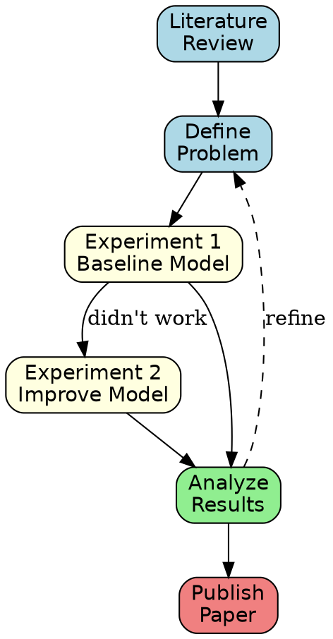
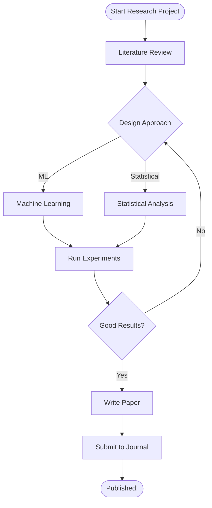

---
up:
  - "[[Landing pad]]"
  - "[[Efforts]]"
related:
aliases:
created: "[[2025-11-13]]"
tags:
  - effort
  - talk
---
# Outline

> [!Quote] Cunningham's Law
> The best way to get the right answer on the Internet is not to ask a question; it's to post the wrong answer

> [!Quote] Knuth's Adage
> Programmers waste enormous amounts of time thinking about, or worrying about, the speed of noncritical parts of their programs, and these attempts at efficiency actually have a strong negative impact when debugging and maintenance are considered. We should forget about small efficiencies, say about 97% of the time: **premature optimization is the root of all evil**. Yet we should not pass up our opportunities in that critical 3%.

About AI:


> [!quote] Sun Tzu
> 


"What I am saying is my personal experience, if there is a better way do tell me."

### Topics to explain
- Git
	- tags 
	- work on dev branch
- Code formatting
- Linting rules for code
	- Ruff https://docs.astral.sh/ruff/rules/
- Using pixi for reproducible code
    - pixi global
- Using uv 
    - https://jacobtomlinson.dev/posts/2025/python-package-managers-uv-vs-pixi/
- Pinning requirements
- zsh config
	- Oh my zsh
	- Reverse search
	- Fuzzy finder
- zoxide
- ipython
- zotero
- copilot
    - alternative providers (openrouter)
- tmux
	- Copying to and from tmux
- vim 
	- vim with vscode
- using aliases and fuzzy search
- drawing diagrams with excalidraw
- quarto for notebooks/websites/slides
- nnn
- rsync
- raycast
- custom search engines
- plotting graphs
    - graphviz
        - https://graphviz.org
    - mermaid
- ripgrep
- bat
- `open`
## Showcase Examples

Below are working examples for each tool category. All files are stored in the repository and can be used as live demos during the talk.

### PYTHON ECOSYSTEM

**pixi** - Reproducible Python environments combining conda and pip:
```toml
[project]
name = "research-project"
version = "0.1.0"
description = "PhD research project with reproducible dependencies"

[dependencies]
python = "3.11.*"
numpy = ">=1.24.0,<2"
pandas = ">=2.0.0"
matplotlib = ">=3.7.0"
jupyter = ">=1.0.0"
pytest = ">=7.0.0"
ruff = ">=0.1.0"

[tasks]
test = "pytest tests/"
lint = "ruff check ."
format = "black ."
```

**uv** - Fast Python package installer written in Rust:
```toml
[build-system]
requires = ["hatchling"]
build-backend = "hatchling.build"

[project]
name = "my-research-tool"
version = "0.1.0"
description = "Fast package management with uv"
requires-python = ">=3.9"
dependencies = [
    "numpy>=1.24.0",
    "pandas>=2.0.0",
    "requests>=2.31.0",
]

[project.optional-dependencies]
dev = [
    "pytest>=7.0.0",
    "black>=23.0.0",
    "ruff>=0.1.0",
]
```

**Pinning requirements** - Exact version control for reproducibility:
```
numpy==1.24.3
pandas==2.1.1
matplotlib==3.8.0
scipy==1.11.3
scikit-learn==1.3.1
jupyter==1.0.0
ipython==8.16.0
pytest==7.4.3
ruff==0.1.5
black==23.11.0
mypy==1.7.1
```

### COMMAND-LINE PRODUCTIVITY

**zsh + Oh My Zsh** - Enhanced shell with productivity features:
```bash
export ZSH="$HOME/.oh-my-zsh"
ZSH_THEME="powerlevel10k/powerlevel10k"

plugins=(
  git
  fzf             # Fuzzy finder
  ripgrep         # rg integration
  python
)

# === USEFUL ALIASES ===
alias ll='ls -lah'
alias python='python3'
alias gs='git status'
alias ga='git add'
alias gc='git commit'
alias gp='git push'
alias gl='git log --oneline -10'

# === ZOXIDE - Fast navigation ===
eval "$(zoxide init zsh)"
# Usage: z <partial-directory-name>

```

**tmux** - Terminal multiplexer for managing long-running processes:
```bash
# Rebind prefix
set -g prefix C-a
unbind C-b

# Mouse support
set -g mouse on

# === COPY TO SYSTEM CLIPBOARD ===
bind-key -T copy-mode-vi 'v' send -X begin-selection
bind-key -T copy-mode-vi 'y' send -X copy-pipe-and-cancel "pbcopy"

# === NAVIGATION ===
bind-key | split-window -h    # Split horizontally
bind-key - split-window -v    # Split vertically

# Navigate between panes
bind -n C-Left select-pane -L
bind -n C-Right select-pane -R

# Session management
# Start: tmux new-session -s work
# Attach: tmux attach -t work
# List: tmux ls
```

**ripgrep** - Super-fast text search in Rust:
```bash
# Simple search
rg "def calculate_mean"

# Case-insensitive
rg -i "TODO"

# Search specific file type
rg "import numpy" --type py

# Find Python function definitions
rg "^def " --type py

# Search with context (3 lines before and after)
rg "error" -B 3 -A 3

# Find all TODO comments
rg "TODO|FIXME|XXX" --type py

# Track variable usage
rg "learning_rate" --type py --count
```

**bat** - Better cat with syntax highlighting and line numbers:
```bash
# View a file with colors
bat script.py

# Show specific lines
bat script.py --line-range 10:20

# Use with git diff
git diff src/model.py | bat

# View with custom theme
bat --theme="Monokai Extended" code.py

# Add to .zshrc
alias cat='bat'
```

### CODE QUALITY

**Ruff** - Fast Python linter written in Rust (replaces flake8, isort, pylint):
```toml
[tool.ruff]
select = ["E", "F", "I", "N", "UP", "RUF"]
ignore = [
    "E501",  # Line too long
    "E225",  # Whitespace around operator
]
line-length = 88
target-version = "py39"
exclude = [".git", ".venv", "venv", "__pycache__", "build", "dist"]

[tool.ruff.per-file-ignores]
"__init__.py" = ["F401"]
"tests/*.py" = ["F841"]

# Usage
# ruff check .          - check all files
# ruff check --fix .    - auto-fix issues
# ruff format .         - format code
```

**Git workflow + tags** - Version control for research reproducibility:
```bash
# Feature branch workflow
git checkout -b feature/neural-network-v2 develop

# Commit frequently with meaningful messages
git add src/model.py
git commit -m "Add dropout layer to prevent overfitting"

# Tag important versions
git tag -a v1.0-baseline -m "Initial baseline model with 85% accuracy"
git push origin v1.0-baseline

# List all tags
git tag -l

# Check out specific version
git checkout v1.0-baseline

# Compare versions
git diff v1.0-baseline v1.1-optimized

# View git history
git log --oneline -10
```

### VISUALIZATION

**Graphviz** - Diagrams as code (text-based, Git-friendly):


**Mermaid** - Interactive diagrams with Markdown-like syntax:


### AI/COPILOT ALTERNATIVES

**OpenRouter** - Access multiple LLMs (Claude, GPT-4, Llama) with single API:

Key advantages for PhD researchers:
- **Cost**: Pay per token instead of $20/month subscription
- **Models**: 50+ LLMs available (not just one)
- **Privacy**: Open source models available (run locally)
- **Flexibility**: Use cheapest model for routine tasks, best model for complex problems

Example cost savings:
- GitHub Copilot: $240/year
- OpenRouter for 500K tokens (100 papers): $7.50 total
- **Savings: 95-99%**

```bash
# Setup
export OPENROUTER_API_KEY="sk-..."

# Code review
openrouter ask "Review this for bugs" < src/model.py

# Document code
openrouter ask "Add detailed docstrings" < my_function.py

# Explain papers
openrouter ask "Explain methodology" < paper.pdf

# Quick vs deep analysis
alias rg-quick="openrouter ask --model 'mistralai/mistral-7b-instruct'"
alias rg-deep="openrouter ask --model 'anthropic/claude-3-opus'"
```

---

## Working Examples in Repository

All working examples and configuration files are in the repository at: `/Users/rcap/opencode-sandbox/`

**Key files:**
- `pixi.toml` - reproducible Python environments
- `pyproject-uv.toml` - uv package manager setup
- `requirements-pinned.txt` - exact version pinning
- `.zshrc.example` - shell configuration with Oh My Zsh
- `tmux.conf.example` - terminal multiplexer setup
- `ripgrep-examples.md` - comprehensive ripgrep usage guide
- `bat-example.md` - bat syntax highlighting examples
- `ruff.toml` - Python linting configuration
- `git-workflow-example.md` - version control best practices
- `graphviz-example.dot` - diagram as code example
- `mermaid-example.md` - interactive diagram examples
- `openrouter-api-example.md` - AI tools alternatives guide

**These examples can be used as live demos during the talk.**


### REMOTE COMPUTING & SLURM (Cluster Workflow)

**SSH key management and passwordless access**
- Files: REMOTE_COMPUTING/ssh-config.example
- Shows: Setting up ed25519 keys, ssh config aliases
- Why: Hundreds of keystrokes saved, enables automation

**rsync for efficient file transfer**
- Files: REMOTE_COMPUTING/rsync-examples.md
- Shows: Smart file syncing, exclude patterns, bandwidth savings
- Why: 10x faster than scp, only transfers changed files

**SLURM job submission basics**
- Files: REMOTE_COMPUTING/slurm-job-examples.sh
- Shows: Simple sbatch scripts, monitoring, output redirection
- Why: Run long experiments without manual monitoring

### NOTEBOOK BEST PRACTICES (Interactive Development)

**Remote Jupyter development with VSCode/PyCharm**
- Files: NOTEBOOKS/jupyter-remote-workflow.md
- Shows: SSH port forwarding, remote kernel setup, interactive editing
- Why: Use familiar IDE while working on cluster

**When to use notebooks vs scripts**
- Notebooks for: Exploration, visualization, teaching
- Scripts for: Production, reproducibility, automation
- Key insight: Convert to .py for version control

### QUARTO - Write Once, Publish Everywhere

**Single source for multiple outputs**
- Files: QUARTO/quarto-example.qmd, QUARTO/quarto-workflow.md
- Shows: Create thesis PDF, defense slides, blog post from same file
- Why: 40+ hours saved over PhD (no duplicate documentation)

### WORKFLOW AUTOMATION (justfile)

**Task definition and dependency management**
- Files: AUTOMATION/justfile.example
- Shows: Define tasks (data → train → evaluate), dependencies
- Why: Everyone knows exactly what to run, reproducible workflow

**SLURM integration with justfile**
- Files: AUTOMATION/justfile-with-slurm.example
- Shows: Submit, monitor, download results from one justfile
- Why: Full automation from local machine

### STRUCTURED LOGGING (Experiment Tracking)

**Python logging for debugging long-running experiments**
- Files: LOGGING/structured-logging-example.py
- Shows: Log levels, timestamps, file + console output
- Why: Find crashes instantly, trace what happened

**Best practices and alternative tools**
- Files: LOGGING/logging-best-practices.md
- Tools mentioned: Weights & Biases, MLflow, TensorBoard
- When to use: Basic logging (free) → W&B (100+ experiments) → TensorBoard (deep learning)

---

## Complete Index


### REMOTE_COMPUTING/
- `ssh-config.example` - SSH passwordless setup
- `rsync-examples.md` - File synchronization guide
- `slurm-job-examples.sh` - Job submission templates

### NOTEBOOKS/
- `jupyter-remote-workflow.md` - Interactive development on cluster

### QUARTO/
- `quarto-example.qmd` - Example document with multiple outputs
- `quarto-workflow.md` - PhD workflow (thesis + slides + blog)

### AUTOMATION/
- `justfile.example` - Task runner with dependencies
- `justfile-with-slurm.example` - SLURM integration

### LOGGING/
- `structured-logging-example.py` - Logging implementation
- `logging-best-practices.md` - Best practices guide

These examples combine with your original tools (Git, ruff, pixi, zsh, etc.) to create a complete modern research workflow.